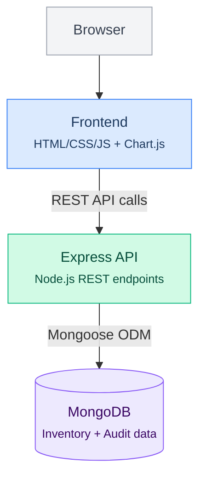

# Smart Warehouse Inventory System


A full-stack inventory management platform with real-time dashboards, low-stock alerting, batch audit workflows, and trend analytics — built with Node.js, Express, MongoDB, and Chart.js.

---

## Features

- **Real-time Dashboard** — Interactive Chart.js visualizations showing stock levels, category breakdowns, and inventory trends over time
- **Item Management** — Full CRUD for inventory items with categorization, quantity tracking, and configurable low-stock thresholds
- **Low-stock Alerts** — Automated notifications when items fall below configurable minimum quantities
- **Audit Workflows** — Batch audit functionality with complete audit trail logging (who changed what, when)
- **Trend Analytics** — Historical data visualization showing stock movement patterns and category-level insights
- **Search & Filter** — Quick search across items with category and status filtering

## Architecture



## Tech Stack

| Layer | Technology |
|-------|-----------|
| **Backend** | Node.js, Express.js |
| **Database** | MongoDB (Mongoose ODM) |
| **Frontend** | HTML, CSS, JavaScript |
| **Charts** | Chart.js |
| **Auth** | Session-based authentication |

## Getting Started

### Prerequisites

- Node.js v16+
- MongoDB (local or MongoDB Atlas)

### Installation

```bash
# Clone the repository
git clone https://github.com/VaibhavGaneriwala/smart-warehouse-inventory-system.git
cd smart-warehouse-inventory-system

# Install dependencies
npm install

# Configure environment
cp .env.example .env
# Edit .env with your MongoDB URI and other settings

# Seed sample data (optional)
npm run seed

# Start the server
npm start
```

The app will be available at `http://localhost:3000`

## API Endpoints

| Method | Endpoint | Description |
|--------|----------|-------------|
| GET | `/api/items` | List all inventory items |
| POST | `/api/items` | Add a new item |
| PUT | `/api/items/:id` | Update an existing item |
| DELETE | `/api/items/:id` | Remove an item |
| GET | `/api/items/low-stock` | Get items below threshold |
| GET | `/api/audits` | Get audit trail logs |
| POST | `/api/audits` | Create a batch audit |
| GET | `/api/dashboard/stats` | Dashboard summary data |

## Project Structure

```
smart-warehouse-inventory-system/
├── config/          # Database & app configuration
├── data/            # Seed data files
├── middleware/       # Auth & request middleware
├── models/          # Mongoose schemas (Item, Audit, User)
├── public/          # Static assets (CSS, JS, Chart.js)
├── routes/          # Express route handlers
├── views/           # Server-rendered views
├── .env.example     # Environment variable template
├── package.json
└── server.js        # Application entry point
```

## License

MIT

---
